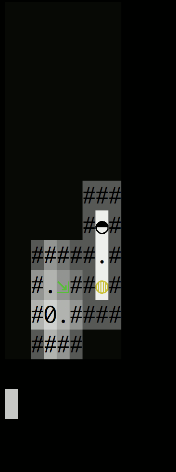

# light-cli
💡 Proof of concept terminal game about directing light.



The goal of the game is to redirect light from the surface down into lower and lower floors of the cave.

## To Play

```
python3 main.py
```

For proper colors you may need to disable your terminal's minimum contrast. In iterm2, this setting is in Preferences, Profiles, Colors, under the Minimum Contrast slider.

## Tile Glossary
```
0 - Player character
. - Floor.
# - Wall. Impassable to light and objects
▢ - Glass. Impassable, transparent
~ - Fog. Passable, blocks light
… - Gravel. Passable to player, but not blocks
◍ - Grate. The level's exit opens when the grate receives a strong light.
⇲ - Exit. Closed until the grate receives strong light.
◐ ◑ ◒ ◓ - Directional light source from the floor above.
◸ ◹ ◺ ◿ - Mirrors, to redirect light
/ \ - Double sided mirror, may redirect light on both sides.
